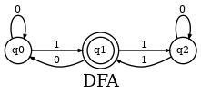

# Ottomata

A toy project.
Implementation of automata algorithms from the book [An Introduction to Formal Languages and Automata 5th Edition](https://dl.acm.org/doi/10.5555/1995326).
It includes algorithms for converting DFA to NFA and vice versa, etc.

Algorithms are translated as-is.
The book focuses on the mathematical correctness of procedure and showing the equity between concepts in automata rather than the computational efficiency of presented algorithms.
I put little effort to optimize them and just translated those pseudo algorithms into haskell code.
So do not expect the performance benchmark to be nice.

This project started with my philosophy on studying: The best way to understand an algorithm is to implement it.
People who stumbled into this project might benefit by using it when studying automata as I did.
Compare your anticipated result with that of the algorithm. Solve your own problems and verify them. Make homework grading automatic. And more.


## Where to use it

Source code is decorated with [haddock style](https://haskell-haddock.readthedocs.io/en/latest/) comments.
So, simply reading through the codebase along with [the book](https://dl.acm.org/doi/10.5555/1995326) would come helpful.
But `Ottomata` shines when you execute your own experiment with concepts in automata.

This is why `Ottomata` is great when used in recitation sessions, where students are supposed to play with and get used to what they have learned.
With some modification on code, students may be asked to come up with a DFA/NFA that accepts test samples or even implement some of the algorithms themselves.

If you are a self-taught student, you are the one who most appreciates.
You can verify your answers to exercise HW, create your own problems and see how things go, implement algorithms yourself and compare the result without having to implement everything from scratch.

Most of all, it's a hands-on experience rather than a passive acceptance of knowledge.


## How to use it

First, clone the project source.
```sh
git clone https://github.com/bivoje/Ottomata.git
```

If you haven't installed haskell toolchain yet, you need to install [haskell stack](https://docs.haskellstack.org/en/stable/README/).
It is a build management system for haskell. Library dependency is handled by `stack`.
```sh
curl -sSL https://get.haskellstack.org/ | sh
```
or
```sh
wget -qO- https://get.haskellstack.org/ | sh
```

All the code snippets are contained in `Ottomata.hs` file.
Load the whole file into `ghci`.
```sh
stack ghci Ottomata.hs
```

For the first time, you build this project, it might take some time. Be patient!
`stack` will cache build results and won't take much time in later uses.
```haskell
...
Ok, one module loaded.
Loaded GHCi configuration from /tmp/haskell-stack-ghci/...
*Ottomata> 
```

Yay, let's run something! Following code prints dot script that represents `sample_dfa1` defined in Ottomata.hs.
```haskell
*Ottomata> printDot . dfa2dot $ sample_dfa1
digraph {
...
}
```
You can visualize it by pasting into [this site](https://Viz-js.com).



Or, if you have [`graphviz` toolchain installed](https://graphviz.org/download/) on your system, you can convert it locally.
Paste the dot script into a file then use `dot` command to visualize.
```haskell
*Ottomata> LT.writeFile "sample_dfa1.dot" G.renderDot . toDot . dfa2dot $ sample_dfa1
```
then in the shell
```sh
$ dot -Tpng -o sample_dfa1.png sample_dfa1.dot
```
`sample_dfa1.png` containing graph representation is created.
For more options, consult the man page of `dot`.

Furthermore, if your system uses [X Window System](https://en.wikipedia.org/wiki/X_Window_System) (most linux distros including Ubuntu does), you can view the result right away by one command.

```haskell
*Ottomta> view sample_dfa1
```
Opens a separate window that shows the graph representation.
`view` is overloaded to most of the data structures in `Ottomata` (`DFA`, `NFA`, `GTG` ..etc) so feel free to use it.

Now, head for reading through the code, your own experiments, and exercises.
If you are writing some codes, I recommend creating Main.hs and import Ottomata to it.


## TODO list

- dot representation does not mark starting state at all, yet.
- create haddock document from source code
